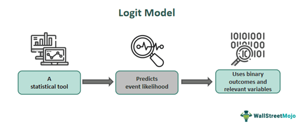

{width="500px"}

## 1. Introduction: Why Do We Need the Logit?

In statistics, we often want to predict the probability of an event. For example, we may want to estimate the probability that a person votes for a certain political party, buys a product, or chooses one transportation option over another.

At first, it seems natural to use a linear regression:

$$
P(Y=1|X)=\beta_0+\beta_1X
$$

However, probability must always lie between 0 and 1. A linear regression can produce values such as 1.2 or -0.3, which cannot be probabilities. The **logit** provides a simple way to solve this problem.

The idea becomes much more intuitive once we start with **odds**.

---

## 2. From Probability to Odds

Odds compare the probability that an event happens with the probability that it does not happen:

$$
\text{Odds}=\frac{p}{1-p}
$$

The idea of odds can be traced back to gambling. Suppose two people play a dice game. Player A wins if the die shows a 3, while Player B wins otherwise.

The probability that A wins is:

$$
P(A)=\frac{1}{6}
$$

The probability that A loses is:

$$
P(A^c)=\frac{5}{6}
$$

Therefore, the odds that A wins are:

$$
\text{Odds}=\frac{1/6}{5/6}=\frac{1}{5}
$$

In other words, for every $1 bet on A, a fair bet would require $5 on B.

Odds are useful, but they are still restricted to positive values. Taking the natural logarithm gives us the **logit transformation**.

---

## 3. The Logit Function: Probability Becomes Log-Odds

The logit function is defined as:

$$
\operatorname{logit}(p)
=
\ln\left(\frac{p}{1-p}\right)
$$

Unlike probability, which is restricted to the interval $(0,1)$, the logit can take any value from $-\infty$ to $+\infty$.

This transformation is useful because it converts a bounded probability into an unbounded variable that can be modeled using a linear equation.

For example, if:

$$
p=0.8
$$

then:

$$
\operatorname{logit}(0.8)
=
\ln\left(\frac{0.8}{0.2}\right)
=
\ln(4)
\approx1.39
$$

The interpretation is straightforward: a probability greater than 0.5 produces positive log-odds, a probability of 0.5 produces zero log-odds, and a probability below 0.5 produces negative log-odds.

---

## 4. The Logit Model

The **logit model** applies this transformation to a statistical model.

Suppose $Y$ is a binary outcome:

$$
Y=
\begin{cases}
1 & \text{if an event occurs}\\
0 & \text{otherwise}
\end{cases}
$$

Let:

$$
p=P(Y=1|X)
$$

A logit model assumes that the log-odds of the event are a linear function of the explanatory variables:

$$
\boxed{
\ln\left(\frac{p}{1-p}\right)
=
\beta_0+\beta_1X_1+\cdots+\beta_kX_k
}
$$

This is the key connection between the logit function and the logit model.

The **logit function** is the transformation

$$
\operatorname{logit}(p)
=
\ln\left(\frac{p}{1-p}\right),
$$

while the **logit model** assumes that this transformed probability is linear in the explanatory variables.

---

## 5. From the Logit Model to Probability

The equation above can be rearranged to obtain the probability itself:

$$
p=
\frac{1}{1+\exp[-(\beta_0+\beta_1X_1+\cdots+\beta_kX_k)]}
$$

This is called the **logistic function**.

It maps any value on the real number line into a value between 0 and 1:

$$
-\infty
\quad\longrightarrow\quad
0
$$

and

$$
+\infty
\quad\longrightarrow\quad
1
$$

Therefore, the logit and logistic functions are inverse transformations:

$$
\boxed{
\operatorname{logit}(p)=\ln\left(\frac{p}{1-p}\right)
}
$$

and

$$
\boxed{
p=\frac{1}{1+e^{-X\beta}}
}
$$

This is why a logit model can describe probabilities without predicting impossible values such as 1.2 or -0.3.

---

## 6. Logit Regression: Estimating the Model

It is important to distinguish the **logit model** from **logit regression**.

The logit model tells us what relationship we assume exists:

$$
\operatorname{logit}(p)=X\beta
$$

But the coefficients $\beta$ are unknown. **Logit regression** is the procedure we use to estimate these coefficients from observed data.

For example, suppose we want to predict whether a person votes for a political party based on age, income, and education:

$$
\operatorname{logit}(p_i)
=
\beta_0
+\beta_1 Age_i
+\beta_2 Income_i
+\beta_3 Education_i
$$

Using a dataset of voters, logit regression estimates:

$$
\hat{\beta}_0,\hat{\beta}_1,\hat{\beta}_2,\hat{\beta}_3
$$

The estimates are typically obtained using **Maximum Likelihood Estimation (MLE)** rather than ordinary least squares.

Therefore, the three concepts can be summarized as follows:

* **Logit function:** transforms probability into log-odds.
* **Logit model:** assumes log-odds are a linear function of explanatory variables.
* **Logit regression:** uses observed data to estimate the coefficients of the model.

---

## 7. Applications in Microeconomics: Discrete Choice

The logit becomes especially useful when consumers make **discrete choices**.

In traditional microeconomics, consumers may choose a continuous quantity, such as how many apples to buy. In real markets, however, consumers often choose one option from several alternatives: one car, one airline, or one breakfast cereal.

Economists can represent this using a **Random Utility Model**:

$$
U_{ij}=\delta_j+\varepsilon_{ij}
$$

where $\delta_j$ represents the average utility of product $j$, while $\varepsilon_{ij}$ captures individual-specific taste differences.

If the random component follows a Type I Extreme Value distribution, the probability that consumer $i$ chooses product $j$ becomes:

$$
s_j=P_{ij}
=
\frac{\exp(\delta_j)}
{\sum_{k=0}^{J}\exp(\delta_k)}
$$

This is the **simple logit model**.

---

## 8. The Unintuitive Part: The Red Bus / Blue Bus Problem

Despite its mathematical beauty, Simple Logit suffers from a major flaw known as **IIA**. 

Consider the ratio of market shares between any two products $j$ and $k$:

$$\frac{s_j}{s_k} = \frac{\exp(\delta_j)}{\exp(\delta_k)}$$

Notice that this ratio depends **only** on products $j$ and $k$, completely unaffected by any third option in the market. 

Suppose commuters can choose between:

* Car: 50%
* Red Bus: 50%

Now suppose a new Blue Bus is introduced. The Blue Bus is almost identical to the Red Bus.

The simple logit model predicts that the three options become approximately:

$$
\text{Car}=33.3\%,\qquad
\text{Red Bus}=33.3\%,\qquad
\text{Blue Bus}=33.3\%
$$

This is unintuitive. Since Blue Bus is almost identical to Red Bus, we would expect it to take mostly passengers away from Red Bus rather than equally reducing the probability of choosing a car.

The problem comes from the logit's assumption that the relative odds between two alternatives do not depend on a third alternative.

This example shows that a model can be mathematically elegant while still making unrealistic behavioral assumptions.

---

## 9. A Better Model: Nested Logit

To fix IIA without losing model tractability, the **Nested Logit Model** groups similar products into "nests" $g \in \{1, \dots, G\}$ (e.g., placing Red Bus and Blue Bus together in a "Bus" nest). 

Taste shocks $\varepsilon_{ij}$ are allowed to be correlated within the same nest, governed by the **nesting parameter** $\lambda \in (0, 1]$:
* $\lambda = 1$: No correlation (collapses back to Simple Logit).
* $\lambda \to 0$: Strong correlation; products in the nest are near-perfect substitutes.

The Nested Logit Estimating Equation：

Decomposing choice into nest selection and within-nest product selection modifies our OLS regression equation by adding **one extra regressor**:

$$\ln\left(\frac{s_j}{s_0}\right) = \mathbf{X}_j \beta - \alpha p_j + (1 - \lambda) \ln(s_{j|g})$$

Where $s_{j|g} = \frac{s_j}{\sum_{k \in g} s_k}$ is product $j$'s market share *within* its own nest $g$. The coefficient on $\ln(s_{j|g})$ directly estimates $(1 - \lambda)$.

---

## 10. Takeaway

The logit is more than just a formula. The **logit function** transforms probability into log-odds, making a bounded probability compatible with a linear specification. The **logit model** uses this transformation to describe binary or discrete choices, while **logit regression** estimates the model's coefficients from data.

The same framework can be extended to consumer choice and other economic applications. However, the Red Bus / Blue Bus example reminds us that a convenient mathematical model may impose strong assumptions about how people substitute between alternatives.

---