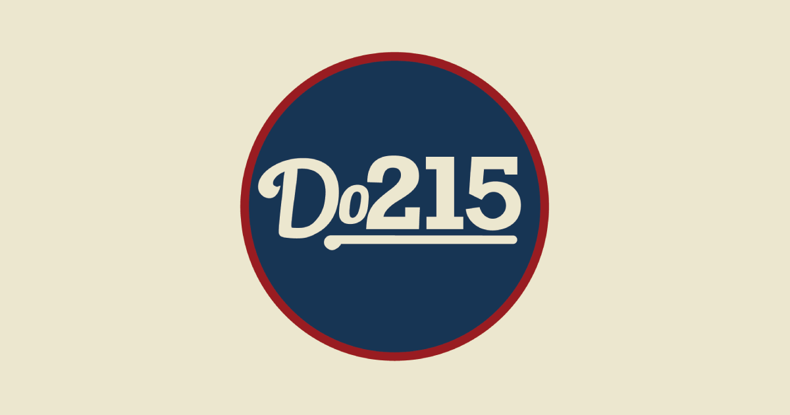
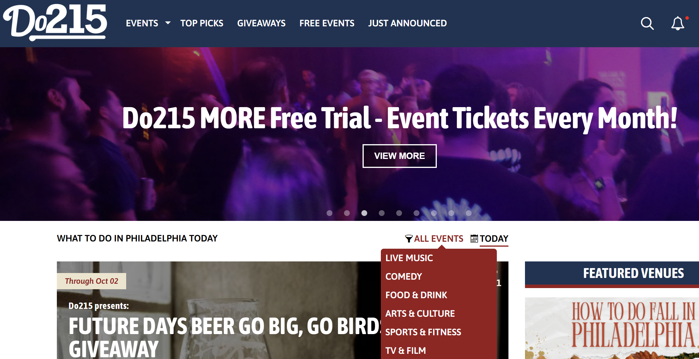
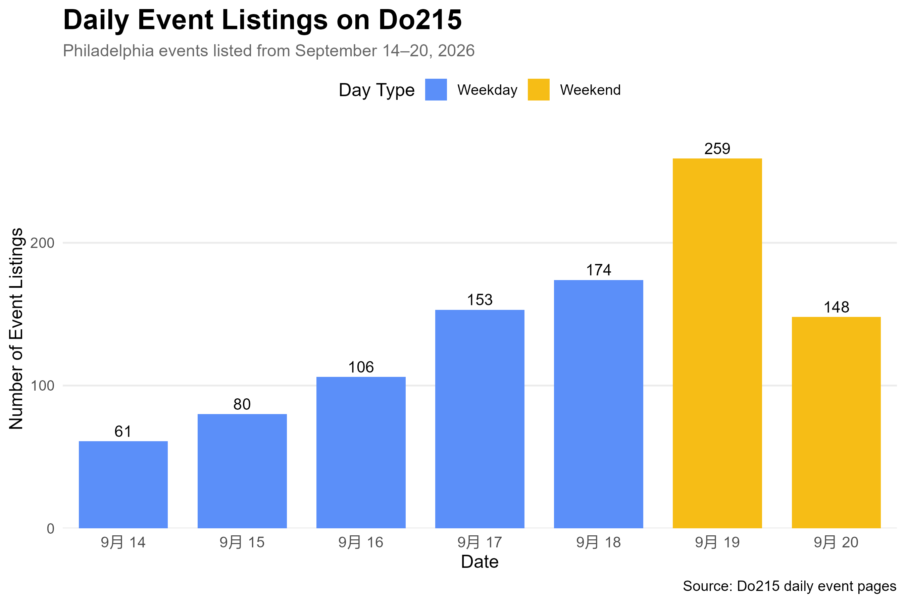
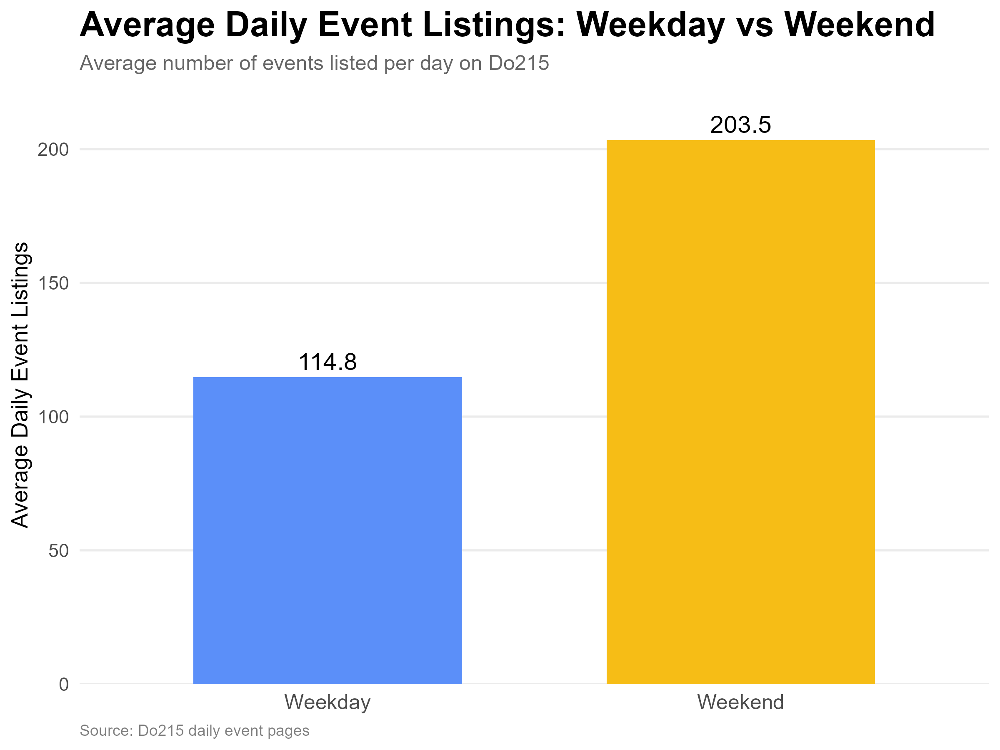
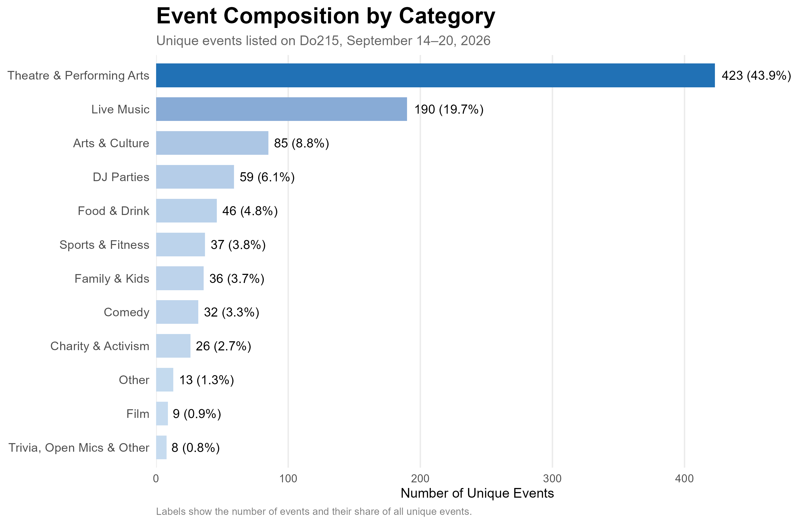
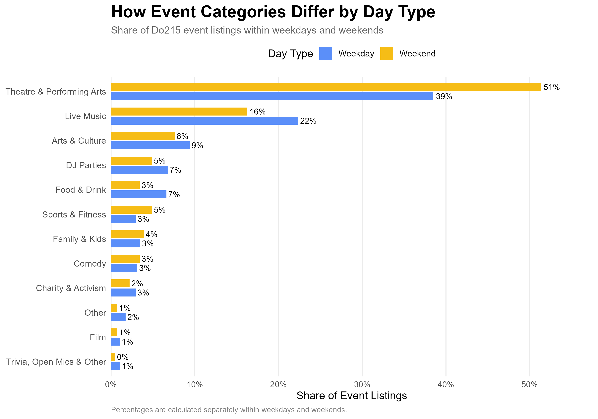
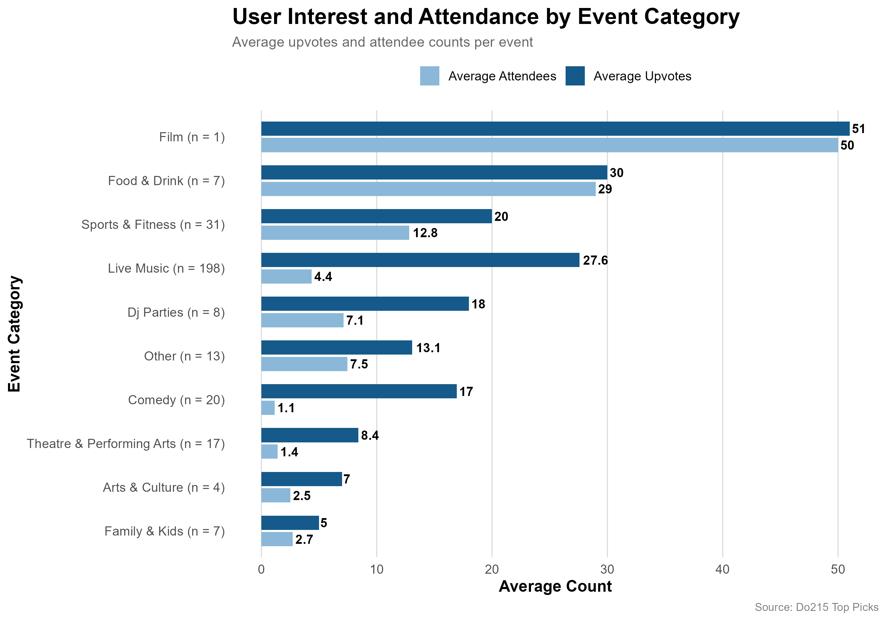

## 1. Question and Motivation

Fall is easily one of the most vibrant seasons in Philadelphia. Between live music, theater productions, game days, and street festivals, the city is packed with things to do. For locals and visitors looking to fill a weekend, the challenge is often deciding where to go. For event organizers, the questions are different: **How crowded is the event market? Which types of events are most common? When are the busiest days? And which kinds of events attract more user interest?**

{width="700px"}

For anyone asking "what should I do tonight?", Do215 is the ultimate directory. As Philly’s go-to guide for local events and culture, Do215 gets its name from Philadelphia's iconic 215 area code, signaling its deep connection to the local scene.

**It covers everything from concerts and comedy shows to art pop-ups and sports, complete with editor-curated "Top Picks," and real-time "Just Announced" tour alerts. Besides, local organizers can list events for free on this platform, while users engage by upvoting their favorite picks and marking whether they’re attending.** This creates a rich stream of real-time audience interest data. This makes Do215 not just a great local guide, but also a lens for exploring Philly's event landscape. 

In this project, I use web scraping to examine the supply and composition of events in Philadelphia and explore whether some types of events receive more attention than others.

{width="700px"}

## 2. Data and Method

I collected two related datasets from publicly available Do215 webpages.

**First**, I scraped the daily event pages for **September 14–20, 2026**. These pages provide a one-week snapshot of Philadelphia's event listings, including event dates, categories, and other event information.

**Second**, I scraped all **13 pages currently available in Do215's Top Picks section**. For each event, I collected information such as the event name, category, venue, date and time, attendee count, and upvote count.

To be more specific, I used the `rvest` package in R to extract the information from the HTML structure of the webpages. I wrote a loop to visit pages 1 through the last page and then combined the results into a single dataset. I also cleaned the text fields, converted dates and times into usable variables, removed duplicate events, and created dummy variables such as weekday and weekend.

The scraping process followed the assignment's ethical requirements. I only collected information from publicly accessible webpages. I did not bypass logins, CAPTCHAs, paywalls, or other access restrictions, and I inserted delays between requests.

## 3. What Does Philadelphia's Event Market Look Like?

The number of event listings varied substantially across the week.

{width="500px"}

Saturday had the largest number of listings, with **259 events**, while Monday had the fewest, with **61**. Listings generally increased from Monday through Saturday, before falling to **148 on Sunday**.

The pattern suggests that event activity generally becomes busier as the weekend approaches. Saturday stands out as the busiest day, while Monday is the quietest. Interestingly, although Sunday is still part of the weekend, it has far fewer listings than Saturday. One possible explanation is that many people use Sunday to prepare for the coming workweek, making it less attractive for late or longer events. The weekday pattern may also reflect how people's leisure time changes throughout the week: Monday tends to be a slower day for entertainment, while interest in going out may increase as the weekend gets closer. However, since this dataset only shows event listings, it cannot tell us exactly why these patterns occur.

{width="500px"}

It is shown that the average number of daily listings was **114.8 on weekdays**, compared with **203.5 on weekends**. In this one-week snapshot, weekends had about 77% more event listings per day than weekdays.

This suggests that the weekend is not only a time when people have more leisure time, but also a much more active period in the local event market. For organizers, that means weekends offer a larger pool of potential event-goers, but they also contain substantially more competing events.

{width="500px"}

Looking across the 964 unique events for last week in the dataset, **Theatre & Performing Arts was the largest category, accounting for 43.9% of all listings. Live Music followed at 19.7%.** Together, these two categories represented nearly two-thirds of all events in the sample.

The remaining categories were much smaller. For example, Arts & Culture accounted for 8.8%, DJ Parties for 6.1%, and Food & Drink for 4.8%.

This concentration suggests that organizers entering categories with many existing listings may face more competition for audience attention. Smaller categories, meanwhile, represent narrower segments of the event market. The data alone do not tell us whether a smaller category reflects lower demand, fewer organizers, or other factors, but they do show where the current supply of listed events is concentrated.

## 4. How Do Event Types Differ Between Weekdays and Weekends?

The composition of events also differs between weekdays and weekends.

{width="500px"}

**Theatre & Performing Arts made up 51% of weekend listings, compared with 39% of weekday listings. Live Music showed the opposite pattern: it accounted for 22% of weekday listings and 16% of weekend listings.** Food & Drink events also represented a larger share of weekday listings, while Sports & Fitness events were somewhat more common on weekends.

One possible explanation is that **different types of events may have different scheduling patterns**. Theater and other performances may be more likely to take place on weekends, when people generally have more free time, while concerts and food-related events may be spread more evenly across the week. Sports and fitness activities may also be easier to schedule on weekends when participants have more flexible schedules.

## 5. How Much Interest Do Different Events Attract?

Do215 also has a “Top Picks” page featuring a selection of highlighted events. Each event includes a upvote button that allows users to show their interest in the event. **A higher number of upvotes** indicates that more users have interacted with the event on the platform, providing a useful signal of online interest. By examining the HTML source of the page, I can also extract **the reported attendee count for each event**.

The Top Picks data allow me to look beyond the number of events and examine how users interact with them. In the analysis, I use **upvotes as a measure of online user interest** and the reported attendee count as a separate measure of event engagement.

{width="700px"}

The chart shows clear differences in both online interest and reported attendance across event categories.

**Film** has the highest average values, **with about 51 upvotes and 50 reported attendees** per event. However, this category contains only one event, so this result should not be treated as a general pattern. **Food & Drink** also stands out, averaging about **30 upvotes and 29 reported attendees** across seven events.

**Sports & Fitness** shows relatively strong engagement as well, with around **20 upvotes and 12.8 reported attendees** per event. In contrast, **Live Music** has a very different pattern. Although it is by far the largest category in the Top Picks sample, with 198 events, its average reported attendance is only 4.4, while its average number of upvotes is much higher at 27.6. **This suggests that live music attracts substantial online attention on Do215, but that online interest does not necessarily translate into a similarly high reported attendee count.**

Overall, Some categories, such as Food & Drink, perform relatively strongly on both measures. While others, particularly Live Music, attract much more online attention than reported attendance. For event organizers, this means that looking at only one engagement measure may give an incomplete picture of an event's potential audience.

## 6. What Can an Event Organizer Take Away?

The data suggest several practical considerations for event organizers.

First, **weekends are much busier than weekdays** on Do215. A weekend event may give organizers access to more people with free time, but it also means competing with many more events. If the main goal is to avoid a crowded event market, a weekday date may offer a different competitive environment.

Second, **event categories are not evenly represented**. Theatre & Performing Arts and Live Music make up a large share of the listings, while categories such as Food & Drink, Comedy, and Sports & Fitness appear less frequently. This does not necessarily mean that smaller categories have lower demand, but it shows that organizers should consider both the level of competition and the type of audience they want to reach.

Third, **online interest and reported attendance tell different stories**. Live Music events, for example, receive relatively high numbers of upvotes but have much lower reported attendance on average. In contrast, Food & Drink events perform relatively well on both measures. This suggests that organizers should not rely on online attention alone when evaluating audience interest.

For an organizer, the main takeaway is to use Do215 as a **market-monitoring tool**. Before planning an event, an organizer could compare the number of competing events across different days, examine which categories are already crowded, and look at both upvotes and reported attendee counts for similar events. This information can help organizers make more informed decisions about when to schedule an event and what type of event to offer, even though it cannot predict attendance or guarantee success.
