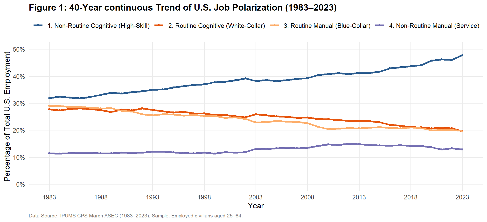
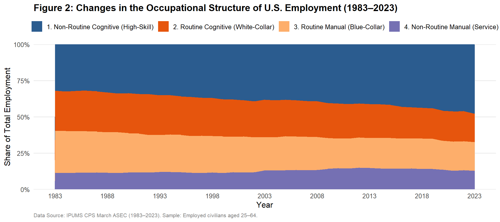
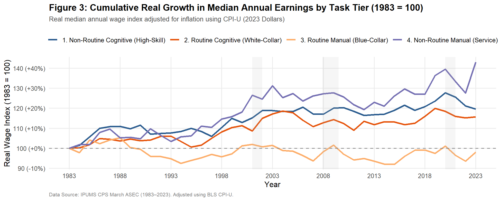
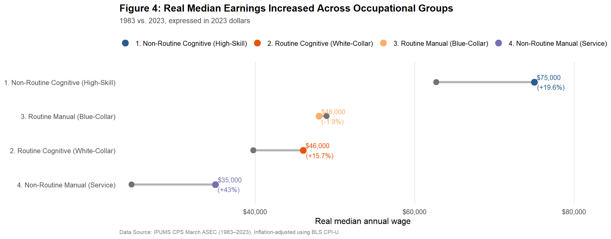

## 1. How Has the U.S. Labor Market Changed Over the Past 40 Years?

The U.S. labor market has changed substantially over the past four decades. Some types of occupations have become much more common, while others have become less common. At the same time, real wages have not changed in the same way across different types of work.

In this post, I ask: 

> **How has the occupational structure of the U.S. labor market changed since the 1980s, and how have real wages evolved across different types of occupations?**

This question is useful because changes in employment shares can show how the structure of the labor market is changing. Looking at wages at the same time also helps us understand whether changes in the demand for different types of work have been associated with different patterns of earnings growth.

## 2. Data

I use microdata from the **IPUMS Current Population Survey (CPS)** from 1983 to 2023. The CPS contains a wide range of information on employment, occupations, income, education, and demographic characteristics.

To study changes in the occupational structure of the labor market, I focus on **employed workers ages 25–64**. This age range helps reduce the influence of workers who are still in school or close to retirement.

For wages, I use reported **annual wage income** and adjust it for inflation using the **CPI-U**, so that all wages are expressed in **2023 dollars**. I then calculate the **weighted median real wage** for each occupational group and year.

Because the CPS is a survey, I use the **ASEC sampling weight (ASECWT)** when calculating employment shares and median wage statistics. This allows the results to better represent the U.S. population covered by the survey rather than simply reflecting the number of observations in my sample.

## 3. The Standard Task-Based Model

To understand these changes, I use the **standard task-based model(Autor, Levy, and Murnane 2003)**, a classic framework in labor economics. Instead of dividing workers into broad categories such as "high-skill" and "low-skill" based mainly on education or income, the task-based approach focuses on the **tasks that workers actually perform**.

The key idea is that an occupation can be viewed as a **bundle of tasks**, and production depends on combining different types of tasks. These tasks can be classified along two dimensions. The first is whether the work is mainly **cognitive or manual**, and the second is whether the tasks are **routine or non-routine**.

The cognitive/manual dimension captures whether a job relies mainly on problem-solving, judgment, and information processing or on physical and manual activities. The routine/non-routine dimension captures whether tasks are repetitive and can be clearly specified by rules and procedures, or whether they require flexibility and are more difficult to codify and automate.

Using the IPUMS **OCC1990 occupation classification**, I group occupations into four task categories: **Non-Routine Cognitive**, **Routine Cognitive**, **Routine Manual**, and **Non-Routine Manual**. The detailed occupation mapping and sample construction are described in the accompanying code.

| Task Type | Key Features | Examples | Impact of Technology / AI |
|:---|:---|:---|:---|
| **Cognitive Routine** | Repetitive tasks that follow clear rules and procedures. | Bank tellers, data entry clerks, entry-level accountants | **More exposed to automation** through software, algorithms, and AI. |
| **Manual Routine** | Repetitive physical tasks that follow fixed procedures. | Assembly-line workers, warehouse sorters, machine operators | **More exposed to replacement** by robots and automated equipment. |
| **Cognitive Non-Routine** | Tasks requiring creativity, problem-solving, judgment, and communication. | Researchers, software architects, managers, physicians | **Technology can complement these tasks** and increase productivity. |
| **Manual Non-Routine** | Physical tasks requiring flexibility, spatial awareness, and adaptation to changing environments. | Cleaners, caregivers, restaurant workers, truck drivers | **Difficult to automate completely** because tasks are harder to standardize. |

## Data Descriptive Analysis

**(a) Employment Share**

The employment structure of the U.S. labor market changed substantially between 1983 and 2023. The below table shows the employment share of each occupational group at five-year intervals.

| Year | Non-Routine Cognitive | Routine Cognitive | Routine Manual | Non-Routine Manual |
|---|---:|---:|---:|---:|
| 1983 | 31.8% | 27.7% | 29.0% | 11.4% |
| 1988 | 33.1% | 27.4% | 28.1% | 11.4% |
| 1993 | 35.0% | 27.5% | 25.5% | 12.0% |
| 1998 | 36.9% | 26.2% | 25.3% | 11.6% |
| 2003 | 38.2% | 25.9% | 22.9% | 13.1% |
| 2008 | 39.2% | 24.7% | 22.6% | 13.5% |
| 2013 | 41.2% | 23.4% | 20.6% | 14.8% |
| 2018 | 43.7% | 21.1% | 21.0% | 14.2% |
| 2023 | 47.8% | 19.6% | 19.8% | 12.8% |

The clearest pattern is the steady increase in the share of **Non-Routine Cognitive occupations**. Their share rose **from 31.8% in 1983 to 47.8% in 2023**, an increase of 16.0 percentage points. By 2023, nearly half of employment was in this occupational group.

In contrast, both **Routine Cognitive** and **Routine Manual** occupations became less common over the same period. The share of **Routine Cognitive** employment fell **from 27.7% to 19.6%**, a decline of 8.1 percentage points. The share of **Routine Manual** employment fell even more, from **29.0% in 1983 to 19.8% in 2023**, a decline of 9.2 percentage points.

The **Non-Routine Manual** group followed a different pattern. Its employment share increased gradually **from 11.4% in 1983 to a peak of 14.8% in 2013, before declining to 12.8% in 2023**. This suggests that, unlike the other three groups, its long-run change was not a simple upward or downward trend.

**(b) Median Real Wage by Occupational Group**

The table below shows the median real wage of each occupational group at five-year intervals from 1983 to 2023.

| Year | Non-Routine Cognitive | Routine Cognitive | Routine Manual | Non-Routine Manual |
|---|---:|---:|---:|---:|
| 1983 | $62,715 | $39,770 | $48,948 | $24,474 |
| 1988 | $69,543 | $41,211 | $51,513 | $25,757 |
| 1993 | $67,477 | $42,173 | $46,391 | $25,304 |
| 1998 | $69,165 | $42,995 | $46,874 | $28,040 |
| 2003 | $74,520 | $46,600 | $49,680 | $32,115 |
| 2008 | $73,379 | $44,841 | $48,118 | $31,135 |
| 2013 | $73,247 | $44,471 | $45,779 | $30,083 |
| 2018 | $75,718 | $46,111 | $48,537 | $31,064 |
| 2023 | $75,000 | $46,000 | $48,000 | $35,000 |

The clearest pattern is that **Non-Routine Cognitive occupations consistently had the highest median real wages** throughout the period. Their median real wage increased from **$62,715 in 1983 to $75,000 in 2023**, an increase of $12,285. Although wages fluctuated somewhat during the period, they remained substantially higher than those of the other three occupational groups.

The **Routine Cognitive** group also experienced an overall increase in real wages. Its median real wage rose **from $39,770 in 1983 to $46,000 in 2023**. The increase was relatively gradual, although wages fluctuated slightly after 2003.

The **Routine Manual** group showed a different pattern. Its median real wage was **$48,948 in 1983 and $48,000 in 2023**, indicating little overall growth over the four decades. Wages reached $51,513 in 1988 before declining and then fluctuating around $46,000–$50,000 in later years.

The **Non-Routine Manual** group had the lowest median real wage throughout the period, but it experienced substantial growth. Its median real wage increased **from $24,474 in 1983 to $35,000 in 2023**, with most of the increase occurring between the 1990s and 2000s. Despite this growth, its median real wage remained below that of the other occupational groups in 2023.

Overall, the wage data show that real wage growth was not uniform across occupational groups. Non-Routine Cognitive occupations maintained the highest wage levels, while Non-Routine Manual occupations experienced the largest proportional increase over the period. Routine Manual occupations, in contrast, showed relatively limited long-run wage growth.

## Data Visualization

**(1) The occupational structure has shifted toward non-routine cognitive work**

{width="900px"}

{width="900px"}

Figure 1 and Figure 2 shows the employment share of the four occupational groups from 1983 to 2023.

The most striking change is the rise in Non-Routine Cognitive employment. Its share increased from roughly one-third of employment in 1983 to almost one-half by 2023. At the same time, both Routine Cognitive and Routine Manual jobs became a smaller share of total employment.

The Routine Cognitive share fell gradually over the period, while the Routine Manual share also declined, particularly after the early 2000s. In contrast, Non-Routine Manual employment remained relatively stable for much of the period and increased somewhat around the late 2000s and early 2010s before declining slightly toward 2023.

Overall, the figure suggests a long-run shift in the composition of employment. The U.S. labor market has become increasingly concentrated in non-routine cognitive occupations, while routine forms of cognitive and manual work have become relatively less common.

This pattern is closely related to the waves of technological change over the past four decades, especially the rapid development of information technology and more specifically, artificial intelligence. New technologies have increasingly automated routine tasks while creating greater demand for workers who perform analytical and other non-routine cognitive tasks.

**(2)  Wage growth has differed substantially across occupational groups**

{width="900px"}

Changes in employment shares do not necessarily tell us how workers in these occupations have been doing financially. Figure 3 therefore compares the cumulative growth in the real median annual wage, with each occupational group normalized to 100 in 1983. The wage measure is adjusted for inflation using CPI-U and expressed in 2023 dollars.

The results show substantial differences across occupational groups. The **Non-Routine Manual group** has the largest cumulative real wage growth over the period, reaching roughly **143** relative to its 1983's 100. One possible explanation is that many occupations in this group are concentrated in the service sector, which has expanded substantially over the past several decades.

**Non-Routine Cognitive** wages also increased substantially, reaching around **120**. **Routine Cognitive** wages rose more moderately, to around **115**.

The most different pattern appears for **Routine Manual** occupations. Their real median wage fluctuated considerably over the period and ended close to, or **slightly below, their 1983 level**. This pattern may be related to technological change, as routine manual tasks are often easier to automate or replace with technology. At the same time, globalization and changes in the demand for different types of labor may have also contributed to the relatively weak wage growth in these occupations.

This is an important result because it shows that employment growth and wage growth do not move together in a simple way. Non-Routine Cognitive employment expanded the most in terms of employment share, but Non-Routine Manual occupations experienced the largest cumulative real wage growth in this comparison.

The shaded recession periods also show that wage trends can fluctuate around major economic downturns. However, the long-run differences between occupational groups are more important than any single short-term movement.

**(3)  What do these changes look like in actual wage levels?**

{width="900px"}

The previous figure focuses on wage growth relative to 1983. This is useful for comparing how quickly wages changed across occupational groups, but an index does not show the actual level of earnings.

Figure 4 therefore compares the real median annual wage in 1983 and 2023 directly using a dumbbell plot. The left point represents the 1983 wage, while the right point represents the 2023 wage. The connecting line shows the change over the 40-year period, and the percentage next to the 2023 point shows the cumulative real wage growth. The figure uses the same weighted median real wage measure as the previous analysis.

The comparison reveals clear differences in both wage levels and wage growth. **Non-Routine Cognitive occupations had the highest median real wage in both years**, increasing from $62,715 in 1983 to $75,000 in 2023, or 19.6% in real terms. **Routine Cognitive** wages also increased, from $39,770 to $46,000, a 15.7% increase. In contrast, **Routine Manual** wages changed very little, declining slightly from $48,948 to $48,000, or 1.9%.

The **Non-Routine Manual group shows the largest proportional increase**, with median real wages rising from $24,474 to $35,000, a 43.0% increase. However, it still had the lowest median wage level in 2023. This highlights an important distinction: a group can experience relatively strong wage growth while starting from a lower wage level and still earning less than other groups.

Together, Figures 3 and 4 provide a more complete picture of wage inequality across occupations. Figure 3 shows how quickly wages changed relative to each group's starting point, while Figure 4 shows the actual wage levels in 1983 and 2023. Looking at both measures helps distinguish between **relative wage growth** and **absolute wage levels**.
