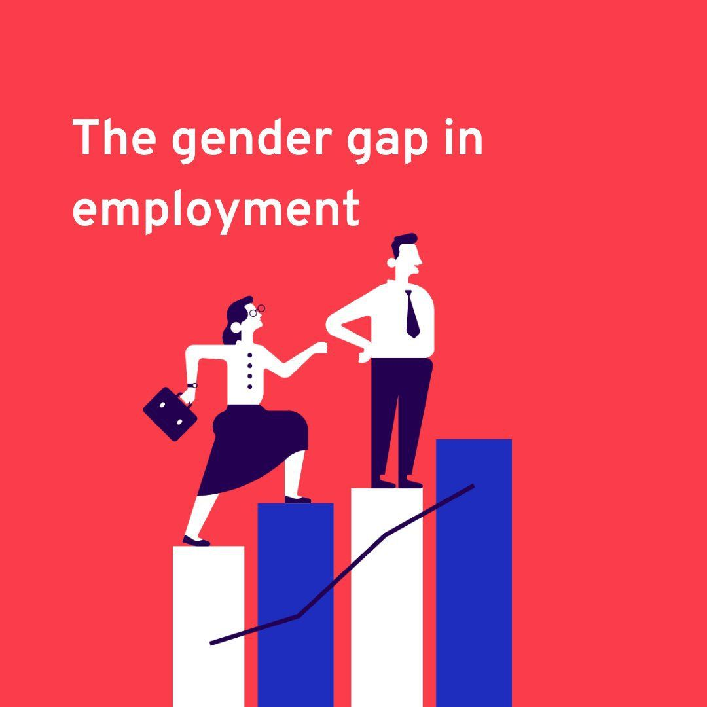

{width="900px"}


## 1. Question and Motivation


Across the globe, women continue to face significant disadvantages in the labor market. They are disproportionately represented in lower-paying and informal jobs, earn less than men on average, and may face hiring barriers because employers expect them to take on greater childcare and household responsibilities. In some regions, social norms and other restrictions further limit women’s access to formal employment. As a result, women participate in the labor force at much lower rates than men. **According to recent estimates from the International Labour Organization (ILO), the global female labor force participation rate is about 47%, compared with nearly 72% for men.**

At the same time, advanced economies generally have higher female labor force participation, stronger legal protections, and smaller gender disparities than many developing countries. This raises an important question:

> **Does economic development systematically narrow the gender gap in labor force participation across countries and over time?**


Understanding this relationship is important for policy making. If economic growth naturally narrows the gender gap, broader economics development may be sufficient to improve gender equality in the labor market. However, if the relationship is slow or non-linear, economic growth alone may not be enough. In this case, policies such as childcare support and anti-discrimination protections will become more important.


## 2. Data Processing and Transformations


### key Variables


To investigate this question, I retrieve cross-country panel data programmatically from the **World Bank World Development Indicators (WDI)** API using the `WDI` package in R. The dataset covers the period from 1990 to 2024 and includes four primary variables:

1. `Female Labor Force Participation Rate`: ILO estimate of the percentage of the female population ages 15+ that is economically active.

2. `Male Labor Force Participation Rate`: ILO estimate of the percentage of the male population ages 15+ that is economically active.

3. `Real GDP per Capita`: Gross domestic product per capita expressed in constant 2021 international dollars using purchasing power parity (PPP) rates.

4. `Income Group`:Official World Bank income classification(**High Income**,**Upper Middle Income**, **Lower Middle Income**, and **Low Income**), which categorizes economies based on GDP per capita thresholds.


### Data Transformations


To ensure meaningful cross-country comparisons, I apply two key transformations:

* **Gender Participation Gap**: Calculated as the male participation rate minus the female participation rate ( $\text{Male LFPR} - \text{Female LFPR}$ ). A gap of zero indicates equal participation rates, while positive values represent higher male participation.

* **GDP Scaling**: For cross-sectional visualization and regression modeling, GDP per capita is converted into units of **$10,000 (constant 2021 PPP dollars)**.


## 3. Conceptual Framework from Claudia Goldin


A useful framework for understanding the relationship between economic development and women's labor force participation is Claudia Goldin's **U-shaped female labor force participation hypothesis**. Goldin (1995) argues that women's participation may first decline and then increase as an economy develops. Evidence from more than 100 countries and the historical experience of the United States support this pattern.

The basic mechanism can be understood in three stages:

| Stage of Development | What Changes? | Female Labor Force Participation |
|:---|:---|:---|
| **Low Income** | Agriculture, family businesses, and household production are important. Women often contribute directly to family production. | Relatively high |
| **Middle Income** | Production moves from households and farms to factories. Jobs require more formal market participation, while childcare responsibilities and social norms may limit women's ability to enter these jobs. | Falls |
| **High Income** | Education rises, service and white-collar jobs expand, and the cost of combining work and family responsibilities falls. | Rises |


The U-shape reflects the changing balance between two forces in women's labor supply. In the early stages of development, a stronger **income effect** can reduce women's need to work for market income. As development continues, the **substitution effect** becomes more important: higher education and better-paying job opportunities increase the opportunity cost of staying outside the labor market. Changes in occupations and social norms can further encourage women's participation. 

One thing to note is that Goldin's original hypothesis concerns **female labor force participation**, whereas my outcome variable is the **gender participation gap**, defined as male labor force participation minus female labor force participation. Therefore, I only use the U-shaped hypothesis as a framework for interpreting the results rather than directly testing it.


## 4. Data Visualization

### (1) Advanced economies have experienced a steady convergence in gender participation gaps

{width="900px"}

Figure 1 tracks the gender labor force participation gap from 1990 to 2024 across six major economies: **China, Germany, Japan, the Republic of Korea, the United Kingdom, and the United States**.

The overall trend is one of gradual convergence. In 1990, Japan, Korea, and Germany had relatively large gender gaps of around 24–27 percentage points. By 2024, these gaps had fallen to **15.8 pp in Japan**, **15.4 pp in Korea**, and **10.8 pp in Germany**. **The United Kingdom** experienced an even larger decline, **from 21.8 pp in 1990 to 8.3 pp in 2024**, giving it the smallest gap among the six countries in 2024.

**China** stands out from this pattern. Its gender participation gap remained relatively small and stable, at **around 11–12 percentage points** throughout the period. This is notable because China had a much lower level of economic development than the other countries in the early 1990s. This relatively small gap therefore can't be explained by income alone. The high participation of Chinese women was also shaped by the country's historical labor policies, high female employment in the formal and agricultural sectors, and social norms that strongly encouraged women's participation in paid work.


### (2) Higher GDP per capita is broadly associated with smaller gender gaps, but variance at low income levels is massive

{width="900px"}

Figure 2 shows the relationship between GDP per capita and the gender labor force participation gap across countries in 2024. Each point represents a country, and the fitted line summarizes the overall relationship in the data.

The visualization highlights two key findings:

**First, there is a negative association between GDP per capita and the gender gap.** Higher-income countries tend to have smaller differences between male and female labor force participation. For example, countries such as **Norway, Denmark, Luxembourg, and Switzerland** are concentrated in the lower-right part of the figure, with gaps **below 10 percentage points**.

**Second, the relationship is much less clear among lower-income countries.** For countries with GDP per capita below roughly $20,000 PPP, the gender gap varies widely, from close to zero to more than 50 percentage points. Countries such as **Afghanistan, Iraq, and Iran** have very large gaps, while some poorer countries, including **Burundi and Moldova** in this sample, have much smaller gaps.

These differences highlight an important point behind the U-shaped hypothesis. **A low gender gap does not necessarily mean that women have greater economic opportunities.** In poorer, largely agricultural economies, women may participate in the labor market because household income is low and family labor is necessary for survival. Much of this work can also take place in agriculture or the informal sector. By contrast, in some countries, social norms, legal restrictions and traditional expectations about women's roles can substantially reduce female labor force participation.

Statistical checks reveal a correlation coefficient of **-0.28** between GDP per capita and the gender gap in 2024. This indicates a negative but relatively modest relationship: **economic development matters, but GDP per capita alone can't explain the large differences across countries.**


### (3) Income group aggregates highlight diverging long-run trajectories


{width="900px"}


Figure 3 groups countries into four World Bank income categories (High, Upper Middle, Lower Middle, and Low income) to to examine how the average gender participation gap has changed over time.

The high-income and upper-middle-income groups show the clearest long-run decline. In the **high income** group, the average gender gap fell from 27.8 percentage points in 1990 to **15.3 percentage points in 2024**. The **upper middle income** group also shows a generally downward trend over the period.

However,in **lower middle income** countries, the average gap remains relatively high and changes more slowly, generally staying **between 21 and 25 percentage points**.

**Low income** countries show a different pattern. Their average gap remains relatively stable at around **14–17 percentage points**. This relatively small gap should not be interpreted as evidence of greater gender equality. In many low income economies, women participate in agricultural, family, or informal work because household income is limited. Female labor force participation can therefore remain high even when job quality, earnings, and economic opportunities are limited.

Taken together, Figure 3 is consistent with the idea that the relationship between development and female labor supply is non-linear. **Gender gaps may remain relatively small in poor agrarian economies, widen during structural transformation, and then narrow again as countries become richer and women gain greater access to education, services, and formal employment. **


## 6. What Do These Results Tell Us?


The evidence from 1990 to 2024 points to three main conclusions.

**First, economic development is generally associated with a narrower gender participation gap.** Most high-income and upper-middle-income countries in the sample show substantial declines in the gap over the past three decades.

**Second, GDP per capita is not enough to explain cross-country differences.** Figure 2 shows that countries with similar income levels can have very different gender gaps. **Social norms,  legal restrictions, and the structure of employment** can all influence whether women participate in the labor force.

**Third, the relationship between economics development and gender participation is non-linear**. This pattern is consistent with the U-shaped Female Labor Force Participation Hypothesis. In low-income agricultural economies, women may have relatively high labor force participation because household income is low and their work is economically necessary. As economies industrialize, women may move out of agricultural and family work faster than they enter formal wage employment, causing the gender gap to widen. At higher levels of development, rising education, better job opportunities, and supportive institutions can contribute to a sustained increase in female labor force participation and a smaller gender gap.

**Main Takeaway**: Economic growth can help reduce gender inequality in labor markets, but growth alone is not sufficient. The cross-country evidence suggests that **economic development, institutions, and social norms work together.** Policies such as affordable childcare, equal employment protections, and more flexible working arrangements can help ensure that economic growth translates into greater opportunities for women.

## 7. Repository Organization & Reproducibility

All data acquisition, cleaning, transformations, and figure rendering in this project are conducted programmatically using R to ensure complete reproducibility.

```text
blog-post-4-gender-gap/
├── README.md
├── data/
│   ├── raw/
│   │   └── wdi_gender_labor_raw.csv
│   └── processed/
│       ├── gender_labor_wdi_clean.csv
│       ├── selected_country_trends.csv
│       ├── cross_section_2024.csv
│       ├── gender_gap_change_1990_2024.csv
│       └── selected_gap_change_1990_2024.csv
├── src/
│   ├── 01_data_processing.R
│   └── 02_data_visualization.R
└── results/
    └── figures/
        ├── figure1.png
        ├── figure2.png
        └── figure3.png
```